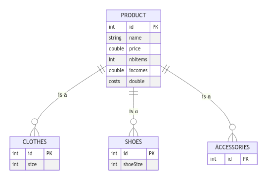
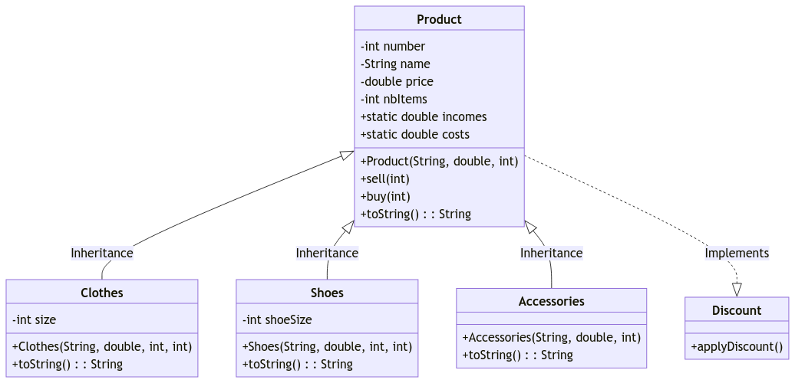
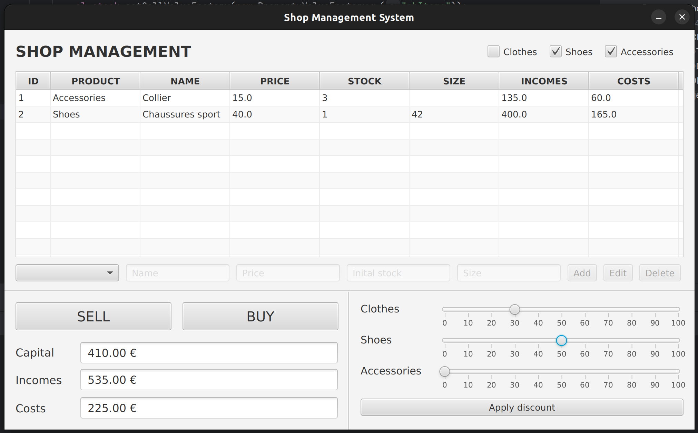
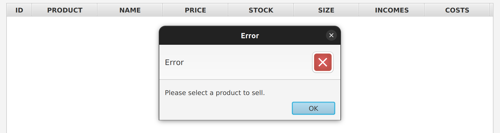
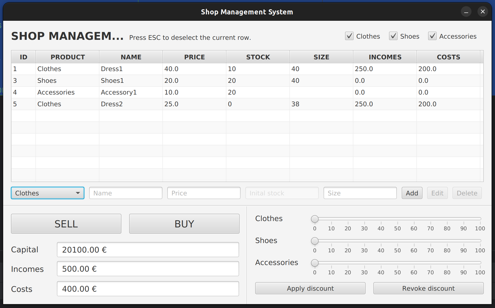

# JavaFX Project - Object-Oriented Programming & Java

This project is about to do the same exercise of Women's Store but with Graphical User Interface and MySQL Database for
persisting data.

To make the application more realistic, we can also add a static field for `capital` for the amount that we start our
activity with, and a static field `cost` to increment each time we purchase items and, in the purchase method, we add a
parameter `purchasePrice` that should be less than the product's price. The capital changes also according to the costs
and incomes.

### Application features:

- [x]  Display the products of different categories with their stock
- [x]  Add/ Modify/ Delete products of each category
- [x]  Display the capital, the global incomes and the global costs
- [x]  Allow for each product to sell or purchase items. This should affect the stock and the incomes or costs.
- [x]  Apply and stop discounts
- [x]  Validate data entry and display messages when errors

## How did we work ?

For this Java project, we decided to pair up following our past successful experiences in group projects. Our
collaboration has been effective and harmonious, allowing us to progress in an organized and proactive way. We are
attentive to each other, which promotes smooth and coordinated progress. Our complementary skills are a major advantage:
we combine expertise in object-oriented programming, user experience, project management, and professional approach.
This synergy enabled us to complete the project in a structured and efficient manner, while exploring new areas and
gaining valuable technical and managerial skills.

## The structure of our project

To carry out this project, we built upon the structure you provided. We utilized a `model` package, which included
various classes previously developed in our practical sessions, along with an additional class, `Administrator.java`.
This class was key for managing system administration tasks, such as financial indicators and interactions with the
DAO (Data Access Object).

In the `dao/ProductLoader.java` file, we handled all interactions with the MySQL database, which was hosted on Google
Cloud to facilitate collaboration. We also employed a controller, `WomanShopController.java`, which managed the
relationship between the UI and back-end. This controller was crucial for triggering alerts in case of back-end errors,
providing user-friendly notifications.

Finally, the UI aspect was managed in the `resources/com/poo/womanshop` package. We had two main
files: `hello-view.fxml`, which we generated automatically using Scene Builder, ensuring the structure of our JavaFX
interface, and `cssfile.css`, which allowed us to handle complex styles, like error indicators on Text-Fields.

```
src/main/java/com/poo/womanshop
├── WomanShopApplication.java
├── contoler
│   └── WomanShopController.java
├── dao
│   └── ProductLoader.java
└── model
    ├── Accessories.java
    ├── Administrator.java
    ├── Clothes.java
    ├── Discount.java
    ├── Product.java
    └── Shoes.java

src/main/resources/com/poo/womanshop
├── cssfile.css
└── hello-view.fxml
```

Then, we created a MySQL database adapted to our architecture, for this, we created it from the following script:

```sql
CREATE TABLE PRODUCT
(
    id      INT                                      NOT NULL PRIMARY KEY,
    type    ENUM ('CLOTHES', 'SHOES', 'ACCESSORIES') NOT NULL,
    name    VARCHAR(255)                             NOT NULL,
    price   DOUBLE                                   NOT NULL,
    nbItems INT                                      NOT NULL,
    incomes DOUBLE,
    costs   DOUBLE
);

CREATE TABLE CLOTHES
(
    id   INT PRIMARY KEY,
    size INT NOT NULL,
    FOREIGN KEY (id) REFERENCES PRODUCT (id) ON DELETE CASCADE
);

CREATE TABLE SHOES
(
    id       INT PRIMARY KEY,
    shoeSize INT NOT NULL,
    FOREIGN KEY (id) REFERENCES PRODUCT (id) ON DELETE CASCADE
);

CREATE TABLE ACCESSORIES
(
    id INT PRIMARY KEY,
    FOREIGN KEY (id) REFERENCES PRODUCT (id) ON DELETE CASCADE
);
```

Each of the CLOTHES, SHOES, and ACCESSORIES tables inherits and extends the PRODUCT table through their `id` field,
which is a foreign key referencing the PRODUCT table's `id`. The 'ON DELETE CASCADE' constraint ensures that if a
product is deleted from the PRODUCT table, its corresponding entries in CLOTHES, SHOES, or ACCESSORIES will also be
automatically deleted. This structure allows for efficient and organized management of different product categories
within the database.

Here is the relational schema resulting from this script:



And finally, we created a UML diagram to better visualize the relationship between our classes.



It represents a class structure for the product management system. The `Product` class serves as the base class,
featuring fields for number, name, price, and quantity of items, as well as methods for selling, buying, and string
representation. The `Clothes`, `Shoes`, and `Accessories` classes inherit from `Product`, each with specific
attributes (like size for clothes and shoes). Additionally, the `Product` class implements a `Discount` interface for
applying discounts.

## Our features



To develop this JavaFX project, we aimed to maintain a simple interface so that the store manager could manage her
business easily and effectively. Our initial decision was to **create a single-page application**. As you can see, all
features are grouped on the screen above.

### 1. **Upper Panel**

In this first part of our application, we grouped all components essential for stock management. Using a `TableView`, we
found an aesthetically pleasing way to display the store's inventory. Each product has its own ID, name, price, stock,
and size. We also track the cumulative costs and revenues generated by each product. For example, after purchasing 12
necklaces at €5 each, the total expenditure was €60. These were later sold at €15 each, totaling €135 in revenue.

Additionally, there's an option to filter items by category. For instance, in the view above, the user has chosen to
display only shoes and accessories (by default, all categories are selected).

The lower part of the panel facilitates stock editing. By default, this form is set to "add" mode. The first step is to
select the product type using the right `ComboBox`, and then, depending on the type, the relevant fields will become
active (for accessories, for example, the size will remain disabled). Then, the `Add` button activates, allowing the
user to validate the entry. In case of format errors or value inconsistencies, the fields will indicate an "error". We
chose to prevent direct input of the number of items in stock when adding a product. We believe stock increments should
occur through a purchase (2).

Finally, in the same panel, selecting an item by clicking on its row in the `TableView` switches to "edit" mode. The
type, name, price, etc., of the product will be displayed in the form. However, certain unchangeable attributes will
remain disabled. The user can only change the product's name and price. This seemed logical to us as it's not feasible
to transform a shoe into a T-shirt or change a size 36 shoe into size 48, right? The user can then choose to `Delete`
the product (which will result in the loss of financial information associated with it) or confirm the changes
with `Edit`. To deselect a product, the user can use the `Escape` key on their keyboard.

This user-friendly interface streamlines the management process, ensuring efficient and error-free operation of the
store.

### 2. **Lower Left Panel**

This second panel, quite straightforward, facilitates the financial management of the store.

The first section includes `Buy` and `Sell` options. By selecting a product in the `TableView`, the user can buy or sell
a product. These actions will be performed in quantities of one each time. This simplifies the simulation and is subject
to change in the final version.

However, before making a purchase, the second section comes into play. It will be impossible for our merchant to have a
negative capital. The following three indicators will then allow them to define their business strategy:

- With the `Capital` field, the merchant will see the remaining funds. For this simulation, they will start with a
  capital of €100, and as purchases and sales are made, expenses will be subtracted, and earnings added. The merchant
  cannot buy an item if it would result in negative capital.
- The `Incomes` field will sum up all the store's earnings, playing a crucial role in managing financial strategy.
- Similarly, the `Costs` field sums up all the store's expenses.

This panel is thus of great importance in the financial management of the store and allows the user to have a
comprehensive view of their situation.

This user-friendly and informative interface empowers the store manager to make informed decisions, ensuring effective
and efficient financial management.

### 3. **Lower Right Panel**

Finally, this third panel allows the user to manage promotions in their store. In a very straightforward manner, with
the help of three sliders, the user can select the desired discount percentage for each category and apply it to their
stock. However, it's important to note that currently, this choice is irreversible. To cancel a promotion, the user must
manually adjust the prices back to their original values.

This intuitive feature simplifies the process of implementing sales strategies, although it requires careful
consideration due to its current lack of reversibility. The inclusion of these sliders offers a quick and effective way
for the store manager to boost sales and attract customers through timely discounts.

## Our improvements Track

As of Friday, December 8th, the initial deadline for our project, there were still some features we had in mind and
wanted to implement in our application. Fortunately, the deadline was extended, giving us additional time to work on
these enhancements.

Here is the list of these improvements and their details:

- [x]  Add an `ESC to unselect` instruction for better user guidance

After testing our application with friends and family, we gathered some valuable feedback, including this suggestion.
This task was accomplished quite easily by simply adding a label in Scene Builder.

- [x]  Handle errors outside of the console

Similarly, based on user testing feedback, we were advised not to display errors in the console (as they would not be
visible to end-users) but to use error "popups" instead. Consequently, we created a function in the controller to handle
these errors. We utilized Java's `Alerts` for this purpose.



- [x]  Managing Discounts in the Database

Lastly, we aimed to add the discount values to the database so that the manager could keep track of currently applied
promotions even after closing and reopening the software. This feature allows for better management and enables the
manager to stop these promotions at any moment using the `Revoke discounts` option.

Here's the MySQL script used to create this new `Discounts` table:

   ```sql
   CREATE TABLE DISCOUNTS
   (
       type          ENUM ('CLOTHES', 'SHOES', 'ACCESSORIES') NOT NULL PRIMARY KEY,
       discount_rate DOUBLE                                   NOT NULL
   );

INSERT INTO DISCOUNTS (type, discount_rate)
VALUES ('CLOTHES', 0.0);
INSERT INTO DISCOUNTS (type, discount_rate)
VALUES ('SHOES', 0.0);
INSERT INTO DISCOUNTS (type, discount_rate)
VALUES ('ACCESSORIES', 0.0);
   ```

For simplicity's sake, we decided to avoid using a second field for the discounted price. Therefore, the price
fluctuates based on the active discount, and the original price is not retained in memory.

- [ ]  Implement Unit Testing (?)

Unfortunately, due to time constraints, we were unable to implement unit testing. However, we recognize its importance
for enhancing the robustness of our application.

- [ ]  Add a Profit Field & Summary Graphs (?)

In a future version, it would be feasible to add a profit field calculated from existing indicators and to create graphs
showing sales trends, for instance. This would imply creating an additional table in our database to store sales history
with their dates of purchase.

# Conclusion:

In conclusion, this project has been highly rewarding for our team. It allowed us to discover and strengthen our
knowledge in Java while developing an enjoyable tool using Java FX. Additionally, interacting with the MySQL database
reminded us of the practical aspects of database usage. We are pleased with the final outcome and have enjoyed working
on this project and exploring new technologies.

---

# Scenario of demo:

Environment `.env` file:

```properties
IP_SERVER=localhost:3306
DB_USERNAME=username
DB_PASSWORD=password
DB_URL=jdbc:mysql://localhost:3306/table_name
```

SQL queries used to fill the database according to the instructions:

```sql
INSERT INTO PRODUCT
VALUES (1, 'CLOTHES', 'Dress1', 30, 10, 0, 0);
INSERT INTO CLOTHES
VALUES (1, 40);
INSERT INTO PRODUCT
VALUES (2, 'CLOTHES', 'Dress2', 40, 20, 0, 0);
INSERT INTO CLOTHES
VALUES (2, 38);
INSERT INTO PRODUCT
VALUES (3, 'SHOES', 'Shoes1', 20, 20, 0, 0);
INSERT INTO SHOES
VALUES (3, 40);
INSERT INTO PRODUCT
VALUES (4, 'ACCESSORIES', 'Accessory1', 10, 20, 0, 0);
INSERT INTO ACCESSORIES
VALUES (4);
```

Results after the simulation:
